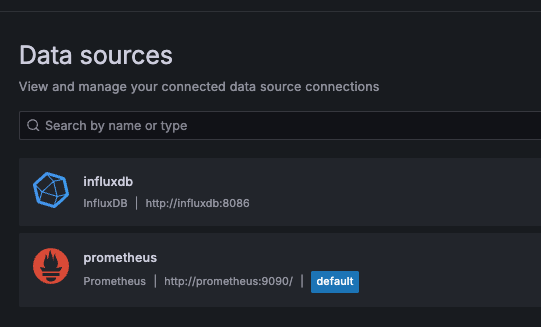

# Backend Portfolio Project

이 프로젝트는 대규모 데이터 처리와 성능 최적화에 중점을 둔 게시판 시스템입니다. Spring Boot, MySQL, Docker, k6, Grafana 등을 사용하여 구현되었습니다.

## 주요 기능

- 회원 가입 및 로그인 (JWT 인증)
- 게시글 작성, 수정, 삭제
- 게시글 목록 조회 (페이징, 정렬, 검색)
- 태그 시스템
- 좋아요 기능
- 카테고리별 통계

## 기술 스택

- **Backend**: Spring Boot, Spring Security, Spring Data JPA
- **Database**: MySQL
- **Containerization**: Docker
- **Load Testing**: k6
- **Monitoring**: Prometheus, Grafana

## 프로젝트 구조

backendportfolio/
├── src/main/java/ding/co/backendportfolio/
│   ├── domain/
│   ├── global/
│   └── BackendportfolioApplication.java
├── resources/
│   ├── application.yml
│   └── mock-data.sql
├── k6-scripts/
└── docs/diagrams/

## 설정 및 실행

1. `./gradlew build`
2. `docker compose up --build`

localhost:3001 접근
admin/admin 로그인 
data source 다음과 같이 설정


### k6로 부하 테스트 실행

1. **k6 설치**: [k6 설치 가이드](https://k6.io/docs/getting-started/installation/)
2. **부하 테스트 실행**:
   ```bash
   k6 run k6-scripts/load-test.js
   ```
docker compose run k6 run /scripts/chapter4-load-test.js

와 같이 실행하면 됨


### Grafana 대시보드 설정
1. **Prometheus 설정**: `prometheus.yml` 파일을 설정하여 Spring Boot 애플리케이션의 메트릭을 수집합니다.
2. **Grafana 설치 및 실행**: Docker를 사용하여 Grafana를 실행합니다.
   ```bash
   docker run -d -p 3000:3000 grafana/grafana
   ```
3. **Grafana에서 Prometheus 데이터 소스 추가**:
   - Grafana 웹 UI에 접속 (`http://localhost:3000`)
   - 데이터 소스 추가에서 Prometheus 선택
   - URL에 Prometheus 서버 주소 입력 ()
4. **대시보드 가져오기**:
   - https://velog.io/@dl-00-e8/%EB%AA%A8%EB%8B%88%ED%84%B0%EB%A7%81-Spring-Boot-Prometheus-Grafana-%EB%8F%84%EC%9E%85%ED%95%98%EA%B8%B0#prometheus-%EB%8C%80%EC%8B%9C%EB%B3%B4%EB%93%9C-%EC%83%9D%EC%84%B1
    - https://velog.io/@eastperson/Spring-Boot-%ED%99%98%EA%B2%BD%EC%97%90%EC%84%9C-K6-Grafana%EB%A5%BC-%ED%99%9C%EC%9A%A9%ED%95%9C-%EB%B6%80%ED%95%98%ED%85%8C%EC%8A%A4%ED%8A%B8-%ED%95%B4%EB%B3%B4%EA%B8%B0
    
    이 쪽 부분에 있는 대시보드 탬플릿 설정 부분 보고 해야 함

## 다이어그램

프로젝트의 구조와 흐름을 설명하는 다이어그램은 [docs/diagrams](./docs/diagrams) 폴더에 있습니다.


# New README

brew install awscli
aws configure -> 자격증명 설정

brew install teraform

1. iam user 들어가서 iam.json 토대로 정책 만들어서 연결
2. ssh-keygen -t rsa -b 2048 -f portfolio-key
3. terrafrom.tfvars 만들어야 함.
4. terraform init & apply 
terraform init
terraform apply
